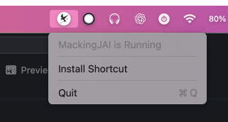

<div align = "center">
    <h1> MackingJAI </h1>
    
    <h3>Mocking OpenAI API through ChatGPT Desktop app</h3>
<br>


</div>

# Overview
MackingJAI mocks the process of using OpenAI API for chat models by using ChatGPT Mac app and Apple Shortcuts. Users can simplify the interaction with ChatGPT without using an API key.

Think of it as [Ollama](https://github.com/ollama/ollama) or any OpenAI API compatible option, but it uses OpenAI's own ChatGPT Desktop app as the backend instead.

# Installation
- Download and install the DMG file from [releases](https://github.com/0ssamaak0/MackingJAI/releases)
- Install the shortcut by clicking on `Install Shortcut` from the menu icon or from [here](https://www.icloud.com/shortcuts/ffd7eadc92534952a6d9e5fac2eaadcd)




- Make sure you have ChatGPT Desktop app installed and running on your Mac.
- In any OpenAI API compatible request, set the API base to `http://127.0.0.1:11435/v1/` instead of `https://api.openai.com/v1` and set any value for the API key. The API key is not used in this mock.
- The shortcut will automatically detect the request and send it to the ChatGPT Desktop app

Note: You may be asked to give some permissions to the shortcut to run. This is necessary for the shortcut to work properly.


## Usage
Theory, you can use any OpenAI API compatible library to make requests to the mocked API. However there are many limitations discussed below.

### Curl:
```bash
curl http://127.0.0.1:11435/v1/chat/completions \
    -H "Content-Type: application/json" \
    -H "Authorization: Bearer No need for API" \
    -d '{
        "model": "o4-mini-high",
    "messages": [
        {
            "role": "system",
            "content": "You are a fact checker, answer with yes or no only"
        },
        {
            "role": "user",
            "content": "Paris is the capiatl of France"
        }
    ]
}'
```

## OpenAI Python
```python
from openai import OpenAI
client = OpenAI(api_key="No need for API", base_url="http://127.0.0.1:11435/v1/")

completion = client.chat.completions.create(
  model="gpt-4o",
  messages=[
    {"role": "developer", "content": "You are a helpful assistant."},
    {"role": "user", "content": "Hello!"}
  ]
)

print(completion.choices[0].message)
```

## LangChain 🦜🔗
```python
from langchain_openai import ChatOpenAI

llm = ChatOpenAI(
    model_name="gpt-4o",
    openai_api_base="http://127.0.0.1:11435/v1",
    openai_api_key="No key",
)
messages = [
    (
        "system",
        "You are a helpful assistant that translates English to French. Translate the user sentence.",
    ),
    ("human", "The quick brown fox jumps over the lazy dog"),
]
ai_msg = llm.invoke(messages)
print(ai_msg)
```

## Open-webui
- add a new OpenAI API compatible connection with URL `http://host.docker.internal:11435/v1` (if you installed openwebui using docker) and set they key to anything

- If you don't use docker, check the URL of Ollama in Ollama A`PI and replace `11434` with `11435` in the URL

> **Tip:** If you are using reasoning models like `o3` or `o4-mini`, it's better to set a different model for Title and Tag Generation.  
> Navigate to `Settings > Admin Settings > Interface > Set Task Model` and choose a non-reasoning model. This will save your quota and speed up the generation process.

# Limitations
- Everything is limited by your chatgpt desktop application and your subscription including available models, rate limits and generation speed.
- There's no way to set the system prompt or use any other parameters.
- You can't send images in this mock.

# Models
By default, all available models in your ChatGPT Desktop app are available in MackingJAI. 
- If you are using a code that uses OpenAI API with acertain snapshot e.g., `gpt-4o-2024-05-13` you will be redirected to the same model.
- `GPT4.1` models are not supported since they are API exclusive. So `gpt-4.1`, `gpt-4.1-mini`, and `gpt-4.1-nano` are redirected to `GPT-4`, `GPT-4o` and `GPT-4o-mini` respectively.

# Todo
- ~~Explore how to integrate conversation history~~ ✅
- ~~Explore how to integrate system prompt if possible~~ ✅
- Create a homebrew cask for easy installation
- Explore similar functionality for Windows users
